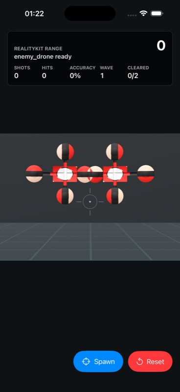

# Asset Brief: enemy_drone

## Purpose

Gameplay purpose:

## Runtime Contract

- Asset id: `enemy_drone`
- Type: `gameplay_target`
- Runtime USDZ path: `Assets/Imported/enemy_drone.usdz`
- Fallback behavior:
- Collision expectation:

## Blender Contract

- Approximate size in meters:
- Origin/pivot:
- Forward/up orientation:
- Triangle budget:
- Texture budget:
- UV primvar:
- Material count:

## Acceptance Criteria

- [x] USDZ exported to `Assets/Imported/enemy_drone.usdz`.
- [x] `Tools/asset_manifest.json` status changed from `planned` to `imported`.
- [x] `make doctor` passes without new errors.
- [x] `make release-check` passes.
- [x] Simulator screenshot captured if visual.
- [x] `Docs/WORKLOG.md` lesson added.

## Prompt Source

```text
red bullseye drone target
```

## Prompt Pipeline Notes

- Inferred archetype: `drone`
- Generated through `python3 Tools/rkp.py prompt-asset enemy_drone --type gameplay_target --prompt ...`.
- Treat the Blender script as a first procedural draft, not final art direction.
- Build creates USDZ; acceptance still requires simulator screenshot evidence.

## Evidence


