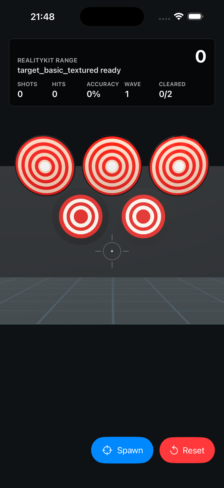

# Asset Brief: material_response_targets

## Gameplay Need

Teach Module 4 material response with one compact comparison asset that can be loaded in the RealityKit fixture without changing the normal target fallback path.

## Visual Contract

- Three target-like panels are visible side by side.
- Left panel: high roughness material value, matte response.
- Center panel: low roughness material value, glossier response.
- Right panel: roughness map variation. The first screenshot proves the map is packaged and loaded, but visual roughness separation remains subtle under the current fixture lighting.
- All panels use the same readable base color ring language as `target_basic_textured`.
- Texture size starts at 512x512.

## Technical Contract

- Asset id: `material_response_targets`
- Runtime file: `Assets/Imported/material_response_targets.usdz`
- Source script: `Tools/blender/create_material_response_targets.py`
- Base color texture: `material_response_targets_basecolor.png`
- Roughness texture: `material_response_targets_roughness.png`
- UV primvar: `st`
- Max triangles: 1800
- Max texture size: 1024

## Acceptance Checklist

- [x] USDZ exported to `Assets/Imported/material_response_targets.usdz`.
- [x] `rkp inspect-usdz material_response_targets --json` passes.
- [x] RealityKit fixture launched with `--material-response-mode`.
- [x] Simulator screenshot captured at `Docs/screenshots/material_response_targets.png`.
- [x] `rkp accept-asset material_response_targets --screenshot Docs/screenshots/material_response_targets.png` passes.
- [x] `Docs/WORKLOG.md` records what was visually readable and what was not.

## Evidence

