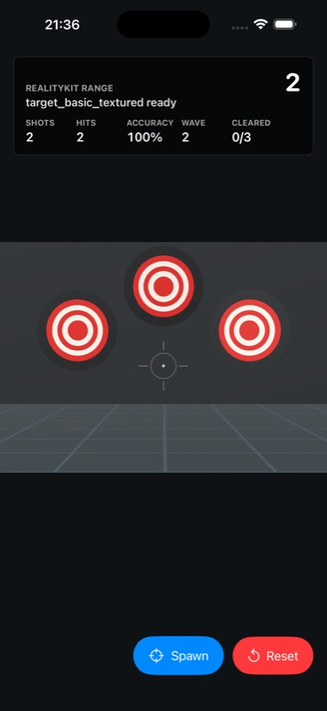

# Feature Brief: Wave Game Loop

## Feature

Name: Wave game loop

One-sentence player value: The player now understands progress as waves instead of an endless target sandbox.

## Current State

The prototype already supports target spawning, projectile hits, ring scoring, reset, and automatic replacement when all targets are cleared.

Relevant files:

- `Sources/RealityKitPipelineDemo/GameSession.swift`
- `Sources/RealityKitPipelineDemo/GameARView.swift`
- `Sources/RealityKitPipelineDemo/ContentView.swift`

## Desired Behavior

Player action: Shoot all visible targets.

Runtime response: When the current wave is cleared, the game advances to the next wave and spawns more targets up to the available deterministic spawn slots.

UI/HUD response:

- HUD shows current wave.
- HUD shows cleared targets as `cleared/targetsThisWave`.
- Score, shots, hits, and accuracy remain visible.

Failure or miss behavior:

- Misses still count as shots and lower accuracy.
- Wave progress only changes when targets are actually destroyed.

Reset behavior:

- Reset starts Wave 1 again.
- Wave 1 starts with 2 targets.

## Asset Contract

New or changed asset ids: none.

USDZ paths: unchanged.

Collision notes: unchanged; existing projectile-target hit resolution remains the source of target destruction.

Fallback behavior: unchanged; target and arena fallbacks still work.

## Acceptance Criteria

- [x] `make release-check` passes locally.
- [x] HUD includes wave and cleared progress.
- [x] Clearing all active targets advances to the next wave.
- [x] Reset returns to Wave 1.
- [x] No asset manifest change required.

Evidence:

## Edge Cases

- Duplicate collision: existing active projectile/target guards remain in place.
- Manual spawn: the debug/practice spawn button adds one target to the current wave target count.
- Spawn slot limit: target count caps at the available deterministic spawn slots.
