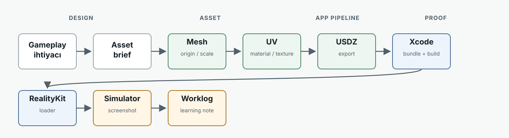

# RealityKit Asset and Texture Pipeline Guide

Bu rehber, Kyylian ve Mehmet'in mobil RealityKit oyunlarında asset ve texture pipeline'ını birlikte öğrenmesi için yazıldı. Amaç sadece bu demoyu çalıştırmak değil; bir `.usdz` asset'in fikir aşamasından simulator screenshot'ına kadar hangi adımlardan geçtiğini anlamak ve aynı süreci yeni assetlerde tekrar edebilmek.

## 1. Overview

### Bu Bölümde Ne Öğreneceğiz?

- Bir oyun asset'inin fikirden çalışan app sahnesine nasıl taşındığını.
- Blender, USDZ, Xcode resource pipeline ve RealityKit loader arasındaki sınırları.
- Neden her adımı screenshot ve worklog ile kapattığımızı.

### Neden Önemli?

3D asset pipeline sorunları genelde tek bir yerde patlamaz. Mesh doğru olabilir ama origin yanlış olabilir; texture doğru olabilir ama UV primvar yanlış olabilir; dosya doğru olabilir ama Xcode bundle'a almamış olabilir. Bu rehber bu zinciri görünür yapar.

### Bitince Ne Yapabiliyor Olacağız?

- Yeni bir asset için dosya adı, scale, origin, texture ve manifest sözleşmesini tanımlamak.
- `.usdz` dosyasını app'e ekleyip RealityKit'te yüklemek.
- Simulator screenshot üzerinden scale, orientation, material ve texture sorunlarını ayıklamak.
- Öğrenilen dersi kalıcı dokümana dönüştürmek.

## 2. Mental Model: Asset Journey





```mermaid
flowchart LR
    A[Gameplay ihtiyacı] --> B[Asset brief]
    B --> C[Mesh / origin / scale]
    C --> D[UV + material + texture]
    D --> E[USDZ export]
    E --> F[Assets/Imported]
    F --> G[asset_manifest.json]
    G --> H[xcodegen generate]
    H --> I[Xcode build]
    I --> J[RealityKit loader]
    J --> K[Simulator screenshot]
    K --> L[Worklog + checklist]
```

Kaynak şema: `Docs/diagrams/pipeline.mmd`, görüntülenebilir SVG: `Docs/diagrams/pipeline.svg`.

### Pipeline Kuralı

Bir asset "bitti" sayılmaz; şu üç şey tamamlanınca kabul edilir:

1. App build alır.
2. RealityKit sahnesinde doğru görünür.
3. Worklog'da build sonucu, screenshot ve öğrenme notu vardır.

## 3. Project Map

| Yol | Görev |
| --- | --- |
| `Assets/Imported` | App'e girecek `.usdz` assetleri |
| `Assets/Textures` | Ayrı tutulan texture kaynakları veya exportları |
| `Tools/asset_manifest.json` | Asset adı, bütçe, status ve notlar |
| `Sources/RealityKitPipelineDemo` | SwiftUI + RealityKit runtime kodu |
| `Docs/WORKLOG.md` | Sprint sonucu, karar ve doğrulama günlüğü |
| `Docs/blender-usdz-checklist.md` | Export sırasında kontrol listesi |
| `Docs/asset-budget.md` | Mobil mesh/texture bütçesi |
| `Docs/diagrams` | Guide ve PDF için şema kaynakları |
| `Docs/screenshots` | Public rehberde kullanılan seçilmiş simulator görsel kanıtları |
| `Docs/pdf` | Paylaşılabilir PDF çıktıları |
| `Build` | Lokal scratch build, DerivedData ve geçici screenshot çıktıları |

## 4. Core Concepts

### Scale

**Tanım:** Asset'in dünya içindeki fiziksel boyutu. Bu projede temel sözleşme `1 Blender unit = 1 meter`.

**Neden önemli:** RealityKit kamerasında küçük bir model dev gibi görünebilir. Blender'da doğru görünen boyut, oyun kamerasında test edilmeden kabul edilmez.

**Bu projedeki ders:** `target_basic.usdz` doğru import edildi ama ekranda çok büyüktü. RealityKit tarafında `0.48` uniform scale ile playable hale getirildi.

### Origin / Pivot

**Tanım:** Entity'nin konumlandırma ve rotasyon merkezi.

**Neden önemli:** Target, gameplay pivot'u merkezde değilse spawn, rotation, collision ve hit detection beklenmedik davranır.

**Kontrol:** Asset sahneye geldiğinde pozisyonu değiştirince model beklenen merkezden hareket ediyor mu?

### UV

**Tanım:** 2D texture'ın 3D mesh üzerine nasıl sarılacağını belirleyen koordinatlar.

**Neden önemli:** Texture dosyası doğru olsa bile UV yanlışsa görsel ters, kaymış veya parçalı görünür.

**Bu projedeki ders:** Blender USD export, aktif UV layer yerine shader'daki UV Map node'unun `uv_map` alanına bakar. Kaynak USDZ `st` primvar kullandığı için düzeltilmiş UV'leri `st` layer'ına yazmak gerekti.

### Material

**Tanım:** Mesh yüzeyinin shader ayarları: base color, roughness, metallic, texture bağlantıları.

**İlk ders kuralı:** Sadece base color texture kullan. Roughness ve metallic'i texture map değil material value olarak bırak.

### Texture

**Tanım:** Material'ın görsel bilgisini taşıyan image map.

**Bu projedeki başlangıç bütçesi:** 512x512 PNG yeterli. 1024x1024 sadece simulator screenshot farkı açıkça gösterirse kullanılacak.

### USDZ

**Tanım:** Apple platformlarında 3D model, material ve texture taşıyabilen paket formatı.

**Kontrol sorusu:** Texture USDZ içine gömülü mü, yoksa dış dosya path'ine mi bağlı kalmış?

### Xcode Resource Bundle

**Tanım:** App build edildiğinde resource dosyalarının `.app` bundle içine kopyalanması.

**Bu projedeki yol:** Asset `Assets/Imported` altına konur, sonra `rtk xcodegen generate` çalıştırılır.

### RealityKit Loader Fallback

**Tanım:** Runtime önce gerçek asset'i arar; yoksa procedural placeholder ile çalışmaya devam eder.

**Neden önemli:** Asset pipeline bozulduğunda gameplay development durmaz. Sprint 3'te loader önce `target_basic_textured`, yoksa `target_basic` deniyor.

## 5. Sprint Walkthroughs

### Sprint 1: First USDZ Import

**Hedef:** İlk gerçek target asset'ini app resource pipeline'a almak.

**Yapılanlar:**

- `target_basic.usdz` dosyası `Assets/Imported` altına eklendi.
- `Tools/asset_manifest.json` içinde status `imported` yapıldı.
- XcodeGen sonrası dosyanın app bundle'a girdiği doğrulandı.
- RealityKit loader asset'i yükledi; asset yoksa procedural fallback çalışmaya devam etti.

**Görsel QA:**

- İlk testte asset edge-on görünüyordu.
- Nested mesh child rotation düzeltildi.
- Sonra target kameraya front-facing hale getirildi.

**Kanıt:**

- `Assets/Imported/target_basic.usdz`
- `Docs/screenshots/target_basic_frontface.png`

**Öğrenme notu:** İlk importta "dosya yüklendi" yeterli değil. Orientation ve child transform ayrı doğrulanmalı.

### Sprint 2: Scale and Spawn Tuning

**Hedef:** Target'ın playable görünmesini sağlamak.

**Problem:**

- Asset doğru yöne bakıyordu ama çok büyüktü.
- Bazı spawn'lar kadraj dışına veya UI alanına yakına düşüyordu.

**Çözüm:**

- Imported target için `0.48` uniform scale uygulandı.
- Random spawn yerine sabit kadraj içi slotlar eklendi.
- Reset sonrası slot sırası sıfırlanarak deterministic test elde edildi.

**Kanıt:**

- `Docs/screenshots/target_basic_scale_slots.jpg`

**Öğrenme notu:** Eğitim ve debugging sırasında deterministic sahne random sahneden daha değerlidir.

### Sprint 3: First Textured Asset

**Hedef:** Tek base color texture içeren ilk USDZ asset'i RealityKit'e almak.

**Yapılanlar:**

- `target_basic_textured.usdz` üretildi.
- Kaynak geometri korundu.
- 512x512 PNG base color texture embed edildi.
- Tek `mat_textured` materyali kullanıldı.
- HUD'da `target_basic_textured ready` görüldü.

**Kritik ders:**

Blender USD export, shader'daki UV Map node'unun `uv_map` alanına bakar. Aktif UV layer tek başına yeterli değildir. Kaynak USDZ `st` primvar kullandığı için yeni UV'yi `st` layer'ına yazmak gerekti.

**Kanıt:**

- `Assets/Imported/target_basic_textured.usdz`
- `Docs/screenshots/target_textured_sprint3_fresh.png`
- `Tools/asset_manifest.json` status: `imported`

**Öğrenme notu:** Texture bug'larında sadece image dosyasına bakma. Shader node, UV layer adı ve USD primvar adı aynı zincirin parçalarıdır.

## 6. Debugging Playbook

| Belirti | Muhtemel Sebep | Kontrol | Çözüm |
| --- | --- | --- | --- |
| Asset görünmüyor | Bundle'a girmedi veya path yanlış | `.app/Imported` içinde dosya var mı? | `rtk xcodegen generate`, manifest ve resource path kontrolü |
| Procedural fallback görünüyor | Imported asset bulunamadı | HUD status ve loader sırası | Dosya adını asset id ile eşleştir |
| Asset edge-on görünüyor | Export axis veya child rotation farklı | Simulator screenshot | Entity veya child orientation düzelt |
| Asset çok büyük | Scale oyun kamerasına uygun değil | Screenshot ve floor referansı | RealityKit scale normalize et veya Blender scale düzelt |
| Texture ters/kaymış | UV projection veya primvar yanlış | UV Map node `uv_map` alanı | Doğru UV'yi `st` veya beklenen primvar'a yaz |
| Texture hiç görünmüyor | Texture embed edilmedi veya material bağlı değil | USDZ inspect / Reality Composer Pro | ImageTexture -> Base Color bağlantısını ve export mode'u kontrol et |
| Build lokal geçiyor ama simulator farklı | Eski bundle/app cache | HUD status ve screenshot timestamp | App'i yeniden build/run et, gerekirse simulator app'i sil |
| Hit detection garip | Collision shape asset ölçüsüne uymuyor | Projectile target mesafesi | Collision radius veya mesh bounds ayarla |

## 7. New Asset Checklist

Bu checklist yeni asset eklerken takip edilecek kısa reçetedir.

1. Asset ihtiyacını tek cümleyle yaz.
2. Asset id seç: `snake_case`.
3. Mesh ölçüsünü metre olarak belirle.
4. Origin/pivot kararını yaz.
5. Triangle ve texture bütçesini `Tools/asset_manifest.json` içinde belirle.
6. UV unwrap yap.
7. İlk denemede tek base color texture kullan.
8. `.usdz` export al.
9. Dosyayı `Assets/Imported` altına koy.
10. Manifest status ve notları güncelle.
11. `rtk xcodegen generate` çalıştır.
12. `rtk xcodebuild -quiet -project RealityKitPipelineDemo.xcodeproj -scheme RealityKitPipelineDemo -destination generic/platform=iOS\ Simulator -derivedDataPath Build/DerivedData build` çalıştır.
13. Simulator'da HUD ve görsel sonucu kontrol et.
14. Screenshot al.
15. `Docs/WORKLOG.md` ve ilgili checklist'e öğrenme notunu yaz.

## 8. PDF / Repo Release Checklist

Repo public hale gelmeden önce:

- README `Docs/guide.md` dosyasına link veriyor.
- `Docs/guide.md` son sprintleri içeriyor.
- `Docs/diagrams/pipeline.svg` görüntülenebiliyor.
- `Tools/asset_manifest.json` parse oluyor ve status'lar doğru.
- Seçilmiş screenshot'lar gerçekten var.
- Büyük geçici build çıktıları public repo'ya girmiyor.
- PDF gerekiyorsa `Docs/pdf/realitykit-pipeline-guide.pdf` taze üretilmiş.

PDF üretmek için:

```bash
rtk pandoc Docs/guide.md --standalone --embed-resources --resource-path=Docs --metadata title="RealityKit Asset and Texture Pipeline Guide" -o Build/realitykit-pipeline-guide.html
rtk weasyprint Build/realitykit-pipeline-guide.html Build/realitykit-pipeline-guide.pdf
rtk cp Build/realitykit-pipeline-guide.pdf Docs/pdf/realitykit-pipeline-guide.pdf
```

## 9. Appendix

### Current Teaching Assets

| Asset | Status | Ders |
| --- | --- | --- |
| `target_basic.usdz` | imported | İlk USDZ import, orientation, scale |
| `target_basic_textured.usdz` | imported | Base color texture, UV primvar, embed |
| `arena_floor.usdz` | todo | Environment replacement adayı |

### Core Commands

```bash
rtk xcodegen generate
rtk xcodebuild -quiet -project RealityKitPipelineDemo.xcodeproj -scheme RealityKitPipelineDemo -destination generic/platform=iOS\ Simulator -derivedDataPath Build/DerivedData build
```

### Evidence Files

| Dosya | Ne kanıtlıyor? |
| --- | --- |
| `Docs/screenshots/target_basic_frontface.png` | Imported target front-facing düzeltmesi |
| `Docs/screenshots/target_basic_scale_slots.jpg` | Scale ve deterministic spawn düzeltmesi |
| `Docs/screenshots/target_textured_sprint3_fresh.png` | Texture'lı asset RealityKit'te yüklendi |
