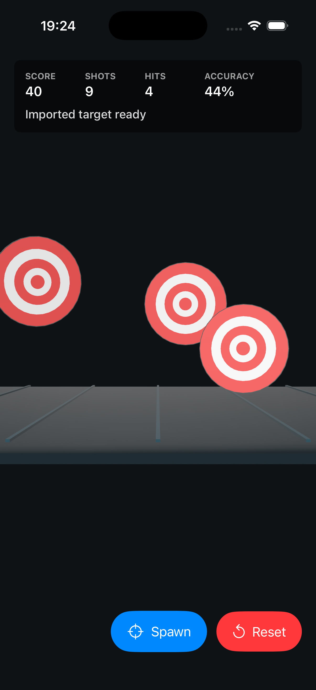
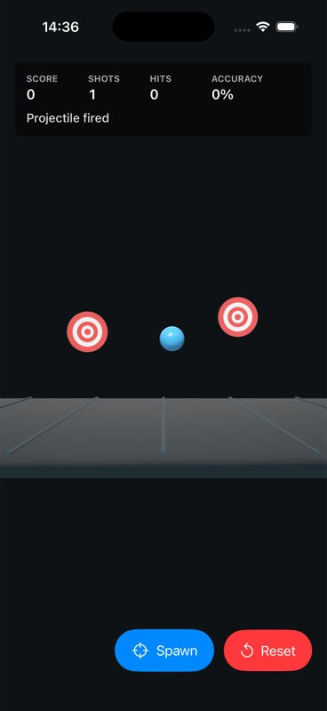
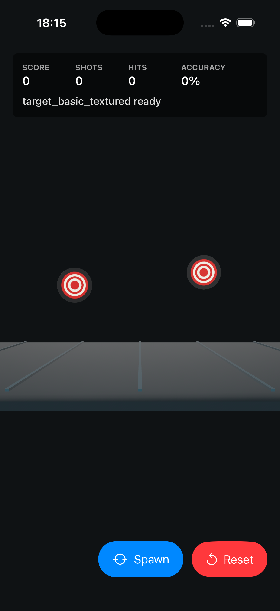

# RealityKit Asset and Texture Pipeline Guide

Bu rehber, Kyylian ve Mehmet'in mobil RealityKit oyunlarında asset ve texture pipeline'ını birlikte öğrenmesi için yazıldı. Amaç sadece bu demoyu çalıştırmak değil; bir `.usdz` asset'in fikir aşamasından simulator screenshot'ına kadar hangi adımlardan geçtiğini anlamak ve aynı süreci yeni assetlerde tekrar edebilmek.

## Executive Summary

Bu proje üç şeyi aynı anda öğretir:

1. **Runtime:** SwiftUI + RealityKit sahnesi, input, target spawn, projectile ve collision.
2. **Asset pipeline:** Blender/üretim aracı -> USDZ -> Xcode resource bundle -> RealityKit loader.
3. **Production discipline:** Her asset işi manifest, build, screenshot ve öğrenme notuyla kapanır.

En önemli prensip: Kalıcı rol ayrımı yok. Bir kişi sadece Blender, diğer kişi sadece kod tarafını bilmeyecek. İş bölümü yapılabilir; fakat her handoff sonunda ikiniz de asset'in amacı, scale/origin kararı, UV/material davranışı, bundle yolu ve RealityKit doğrulamasını açıklayabilmelisiniz.

## How to Use This Guide

### Hedef Kitle

- RealityKit öğrenen iOS/macOS geliştiricileri.
- Blender veya 3D asset workflow'una yeni giren ekip üyeleri.
- Oyun prototipinde asset pipeline'ı sistemli kurmak isteyen küçük ekipler.

### Ön Koşullar

- Xcode kurulu.
- XcodeGen kurulu.
- `rtk` CLI mevcut.
- Blender veya Blender MCP tabanlı asset üretim yolu mevcut.
- Temel terminal ve SwiftUI bilgisi.

### Önerilen Çalışma Formatı

| Süre | Aktivite |
| ---: | --- |
| 10 dk | Bu rehberdeki mental model ve proje haritasını okuyun. |
| 20 dk | Sprint 1-3 walkthrough'larını screenshot'larla inceleyin. |
| 30 dk | Yeni asset checklist'ini takip ederek küçük bir varyasyon üretin. |
| 15 dk | Debugging playbook ile sonucu yorumlayın. |
| 10 dk | Worklog'a ne öğrendiğinizi yazın. |

### Completion Standard

Bir asset işi, ancak şu kanıtlarla kapanır:

- `Tools/asset_manifest.json` içinde doğru status ve not var.
- `rtk xcodebuild ... -derivedDataPath Build/DerivedData build` geçiyor.
- Simulator screenshot alındı.
- HUD veya sahne asset'in gerçekten yüklendiğini gösteriyor.
- Öğrenme notu `Docs/WORKLOG.md` veya checklist'e işlendi.

## 1. Mental Model: Asset Journey

```mermaid
flowchart LR
    A[Gameplay ihtiyacı] --> B[Asset brief]
    B --> C[Mesh / origin / scale]
    C --> D[UV + material + texture]
    D --> E[USDZ export]
    E --> F[Assets/Imported]
    F --> G[asset_manifest.json]
    G --> H[xcodegen generate]
    H --> I[Xcode build]
    I --> J[RealityKit loader]
    J --> K[Simulator screenshot]
    K --> L[Worklog + checklist]
```




Kaynak şema: `Docs/diagrams/pipeline.mmd`, görüntülenebilir SVG: `Docs/diagrams/pipeline.svg`.

### The Chain of Custody

Asset pipeline'ı bir teslim zinciri gibi düşünün:

| Aşama | Çıktı | Kabul Kriteri |
| --- | --- | --- |
| Gameplay ihtiyacı | Tek cümlelik asset amacı | Asset'in neden var olduğu açık |
| Asset brief | Ölçü, origin, bütçe, materyal beklentisi | Üretim başlamadan sınırlar belli |
| Mesh | Model geometri | Triangle bütçesine uyuyor |
| UV + material | Texture bağlanabilir yüzey | UV primvar ve material node zinciri net |
| USDZ export | `.usdz` dosyası | Texture embed veya paket ilişkisi doğrulanmış |
| Xcode resource | App bundle içeriği | Dosya `.app` içine giriyor |
| RealityKit loader | Runtime entity | HUD/sahne doğru asset'i gösteriyor |
| Screenshot | Görsel kanıt | Scale/origin/orientation/material okunuyor |
| Worklog | Öğrenme hafızası | Aynı hata tekrar yaşandığında çözüm bulunabiliyor |

## 2. Project Map

| Yol | Görev |
| --- | --- |
| `Assets/Imported` | App'e girecek `.usdz` assetleri |
| `Assets/Textures` | Ayrı tutulan texture kaynakları veya exportları |
| `Tools/asset_manifest.json` | Asset adı, bütçe, status ve notlar |
| `Sources/RealityKitPipelineDemo` | SwiftUI + RealityKit runtime kodu |
| `Docs/WORKLOG.md` | Sprint sonucu, karar ve doğrulama günlüğü |
| `Docs/blender-usdz-checklist.md` | Export sırasında kontrol listesi |
| `Docs/asset-budget.md` | Mobil mesh/texture bütçesi |
| `Docs/diagrams` | Guide ve PDF için şema kaynakları |
| `Docs/screenshots` | Public rehberde kullanılan seçilmiş simulator görsel kanıtları |
| `Docs/pdf` | Paylaşılabilir PDF çıktıları |
| `Build` | Lokal scratch build, DerivedData ve geçici screenshot çıktıları |

## 3. Core Concepts

### 3.1 Scale

**Tanım:** Asset'in dünya içindeki fiziksel boyutu. Bu projede temel sözleşme `1 Blender unit = 1 meter`.

**Neden önemli:** RealityKit kamerasında küçük bir model dev gibi görünebilir. Blender'da doğru görünen boyut, oyun kamerasında test edilmeden kabul edilmez.

**Bu projedeki ders:** `target_basic.usdz` doğru import edildi ama ekranda çok büyüktü. RealityKit tarafında `0.48` uniform scale ile playable hale getirildi.

**Kendini test et:** Bir target'ı `0.3`, `0.48`, `0.75` scale ile açıp screenshot karşılaştırması yap. Hangisi oynanabilir alanı ve UI'ı daha iyi koruyor?

### 3.2 Origin / Pivot

**Tanım:** Entity'nin konumlandırma ve rotasyon merkezi.

**Neden önemli:** Target, gameplay pivot'u merkezde değilse spawn, rotation, collision ve hit detection beklenmedik davranır.

**Kontrol:** Asset sahneye geldiğinde pozisyonu değiştirince model beklenen merkezden hareket ediyor mu? Rotation uygulandığında merkez etrafında mı dönüyor?

### 3.3 UV

**Tanım:** 2D texture'ın 3D mesh üzerine nasıl sarılacağını belirleyen koordinatlar.

**Neden önemli:** Texture dosyası doğru olsa bile UV yanlışsa görsel ters, kaymış veya parçalı görünür.

**Bu projedeki kritik ders:** Blender USD export, aktif UV layer yerine shader'daki UV Map node'unun `uv_map` alanına bakar. Kaynak USDZ `st` primvar kullandığı için düzeltilmiş UV'leri `st` layer'ına yazmak gerekti.

**Kabul kriteri:** Texture rings hedefin merkezine oturuyor; ters, kaymış veya parçalanmış görünmüyor.

### 3.4 Material

**Tanım:** Mesh yüzeyinin shader ayarları: base color, roughness, metallic, texture bağlantıları.

**İlk ders kuralı:** Sadece base color texture kullan. Roughness ve metallic'i texture map değil material value olarak bırak.

**Neden:** İlk importta sorun çıktığında hata yüzeyini küçük tutar. Base color çalışmadan roughness/normal map eklemek debug maliyetini yükseltir.

### 3.5 Texture

**Tanım:** Material'ın görsel bilgisini taşıyan image map.

**Bu projedeki başlangıç bütçesi:** 512x512 PNG yeterli. 1024x1024 sadece simulator screenshot farkı açıkça gösterirse kullanılacak.

**Kabul kriteri:** Texture okunur, UV yönü doğru, dosya boyutu mobil bütçe içinde.

### 3.6 USDZ

**Tanım:** Apple platformlarında 3D model, material ve texture taşıyabilen paket formatı.

**Kontrol sorusu:** Texture USDZ içine gömülü mü, yoksa dış dosya path'ine mi bağlı kalmış?

**Pratik not:** `export_textures_mode='NEW'` bazı path uyarıları verebilir; asıl kabul RealityKit ve simulator screenshot sonucudur.

### 3.7 Xcode Resource Bundle

**Tanım:** App build edildiğinde resource dosyalarının `.app` bundle içine kopyalanması.

**Bu projedeki yol:** Asset `Assets/Imported` altına konur, sonra `rtk xcodegen generate` çalıştırılır.

### 3.8 RealityKit Loader Fallback

**Tanım:** Runtime önce gerçek asset'i arar; yoksa procedural placeholder ile çalışmaya devam eder.

**Neden önemli:** Asset pipeline bozulduğunda gameplay development durmaz. Sprint 3'te loader önce `target_basic_textured`, yoksa `target_basic` deniyor.

## 4. Sprint Walkthroughs

### Sprint 1: First USDZ Import

**Öğrenme hedefi:** İlk gerçek target asset'ini app resource pipeline'a almak.

**Yapılanlar:**

- `target_basic.usdz` dosyası `Assets/Imported` altına eklendi.
- `Tools/asset_manifest.json` içinde status `imported` yapıldı.
- XcodeGen sonrası dosyanın app bundle'a girdiği doğrulandı.
- RealityKit loader asset'i yükledi; asset yoksa procedural fallback çalışmaya devam etti.

**Görsel QA:**



Bu görüntüde hedef artık kameraya dönük. İlk testte asset edge-on görünüyordu; nested mesh child rotation ve front-face düzeltmesiyle kırmızı/beyaz halkalar okunur hale geldi.

**Öğrenme notu:** İlk importta "dosya yüklendi" yeterli değil. Orientation ve child transform ayrı doğrulanmalı.

**Acceptance:** Asset bundle'da var, HUD imported target durumunu gösteriyor, screenshot'ta hedefin ön yüzü okunuyor.

### Sprint 2: Scale and Spawn Tuning

**Öğrenme hedefi:** Target'ın playable görünmesini sağlamak.

**Problem:**

- Asset doğru yöne bakıyordu ama çok büyüktü.
- Bazı spawn'lar kadraj dışına veya UI alanına yakına düşüyordu.

**Çözüm:**

- Imported target için `0.48` uniform scale uygulandı.
- Random spawn yerine sabit kadraj içi slotlar eklendi.
- Reset sonrası slot sırası sıfırlanarak deterministic test elde edildi.

**Görsel QA:**



Bu görüntüde iki target kadraj içinde, floor referansına göre okunur ölçekte ve alt butonlarla çakışmadan görünüyor.

**Öğrenme notu:** Eğitim ve debugging sırasında deterministic sahne random sahneden daha değerlidir.

**Acceptance:** Target'lar HUD, floor ve control button'larla çakışmadan görünür; reset sonrası test sahnesi tekrar üretilebilir.

### Sprint 3: First Textured Asset

**Öğrenme hedefi:** Tek base color texture içeren ilk USDZ asset'i RealityKit'e almak.

**Yapılanlar:**

- `target_basic_textured.usdz` üretildi.
- Kaynak geometri korundu.
- 512x512 PNG base color texture embed edildi.
- Tek `mat_textured` materyali kullanıldı.
- HUD'da `target_basic_textured ready` görüldü.

**Görsel QA:**



Bu görüntüde texture'lı target RealityKit'te yüklenmiş durumda. Halkalar merkezde, UV yönü doğru ve scale/origin önceki target ile tutarlı.

**Kritik ders:** Blender USD export, shader'daki UV Map node'unun `uv_map` alanına bakar. Aktif UV layer tek başına yeterli değildir. Kaynak USDZ `st` primvar kullandığı için yeni UV'yi `st` layer'ına yazmak gerekti.

**Acceptance:** `Tools/asset_manifest.json` status `imported`; HUD `target_basic_textured ready`; screenshot'ta texture ters/kaymış değil.

## 5. Hands-on Labs

### Lab A: Manifest Okuma

**Amaç:** Asset status ve bütçe bilgisini yorumlamak.

1. `Tools/asset_manifest.json` dosyasını aç.
2. `target_basic_textured` kaydını bul.
3. `maxTriangles`, `maxTextureSize`, `textureMaps` ve `notes` alanlarını oku.
4. Kendi cümlenle bu asset'in neden kabul edildiğini yaz.

**Başarı kriteri:** Asset'in triangle, texture, material ve doğrulama bilgisini manifest üzerinden açıklayabiliyorsun.

### Lab B: Loader Fallback Mantığı

**Amaç:** Asset yokken gameplay'in neden durmadığını anlamak.

1. `GameARView.swift` içinde `loadTargetAsset()` fonksiyonunu oku.
2. Loader sırasını not et.
3. `target_basic_textured.usdz` yoksa ne olacağını sözlü açıkla.

**Başarı kriteri:** Fallback'in gameplay development hızını nasıl koruduğunu açıklayabiliyorsun.

### Lab C: New Texture Variant

**Amaç:** Aynı pipeline'ı yeni bir görsel varyasyonda tekrar etmek.

1. Yeni asset id seç: `target_basic_blue_textured`.
2. 512x512 tek base color texture üret.
3. UV primvar adını doğrula.
4. USDZ export al.
5. Manifest kaydı ekle.
6. Build ve simulator screenshot ile doğrula.

**Başarı kriteri:** Yeni texture varyasyonu manifest, build, screenshot ve worklog notuyla kapanıyor.

## 6. Debugging Playbook

| Belirti | Muhtemel Sebep | Kontrol | Çözüm |
| --- | --- | --- | --- |
| Asset görünmüyor | Bundle'a girmedi veya path yanlış | `.app/Imported` içinde dosya var mı? | `rtk xcodegen generate`, manifest ve resource path kontrolü |
| Procedural fallback görünüyor | Imported asset bulunamadı | HUD status ve loader sırası | Dosya adını asset id ile eşleştir |
| Asset edge-on görünüyor | Export axis veya child rotation farklı | Simulator screenshot | Entity veya child orientation düzelt |
| Asset çok büyük | Scale oyun kamerasına uygun değil | Screenshot ve floor referansı | RealityKit scale normalize et veya Blender scale düzelt |
| Texture ters/kaymış | UV projection veya primvar yanlış | UV Map node `uv_map` alanı | Doğru UV'yi `st` veya beklenen primvar'a yaz |
| Texture hiç görünmüyor | Texture embed edilmedi veya material bağlı değil | USDZ inspect / Reality Composer Pro | ImageTexture -> Base Color bağlantısını ve export mode'u kontrol et |
| Build lokal geçiyor ama simulator farklı | Eski bundle/app cache | HUD status ve screenshot timestamp | App'i yeniden build/run et, gerekirse simulator app'i sil |
| Hit detection garip | Collision shape asset ölçüsüne uymuyor | Projectile target mesafesi | Collision radius veya mesh bounds ayarla |

## 7. Quality Rubric

| Seviye | Tanım |
| --- | --- |
| 0 - Not started | Asset yok veya manifest kaydı yok. |
| 1 - File present | `.usdz` dosyası var ama build/runtime doğrulaması yok. |
| 2 - Bundle verified | Build geçiyor ve asset bundle'a giriyor. |
| 3 - Runtime verified | RealityKit sahnesinde doğru asset yükleniyor. |
| 4 - Visual accepted | Screenshot scale/origin/orientation/material açısından kabul edildi. |
| 5 - Teaching complete | Worklog, checklist, manifest ve screenshot güncel; ekip dersi açıklayabiliyor. |

Bu projede public guide'a girecek assetler için hedef seviye **5**.

## 8. New Asset Checklist

Bu checklist yeni asset eklerken takip edilecek kısa reçetedir.

1. Asset ihtiyacını tek cümleyle yaz.
2. Asset id seç: `snake_case`.
3. Mesh ölçüsünü metre olarak belirle.
4. Origin/pivot kararını yaz.
5. Triangle ve texture bütçesini `Tools/asset_manifest.json` içinde belirle.
6. UV unwrap yap.
7. İlk denemede tek base color texture kullan.
8. `.usdz` export al.
9. Dosyayı `Assets/Imported` altına koy.
10. Manifest status ve notları güncelle.
11. `rtk xcodegen generate` çalıştır.
12. Workspace-local build al:

   ```bash
   rtk xcodebuild -quiet -project RealityKitPipelineDemo.xcodeproj -scheme RealityKitPipelineDemo -destination generic/platform=iOS\ Simulator -derivedDataPath Build/DerivedData build
   ```

13. Simulator'da HUD ve görsel sonucu kontrol et.
14. Screenshot al.
15. `Docs/WORKLOG.md` ve ilgili checklist'e öğrenme notunu yaz.

## 9. Glossary

| Terim | Kısa açıklama |
| --- | --- |
| Asset | Oyunda kullanılan model, texture, ses veya benzeri üretim çıktısı. |
| USDZ | Apple ekosisteminde yaygın kullanılan paketlenmiş 3D asset formatı. |
| Primvar | USD içinde mesh üzerinde taşınan vertex/face-varying veri; UV için `st` yaygındır. |
| UV | 2D texture koordinatları. |
| Base color | Material'ın temel renk/texture girdisi. |
| Roughness | Yüzeyin ışığı ne kadar yaydığını belirleyen material değeri. |
| Metallic | Yüzeyin metal davranışı gösterip göstermediğini belirleyen material değeri. |
| Origin / pivot | Entity'nin transform merkezi. |
| Bundle | Build sonrası app içine kopyalanan resource paketi. |
| Fallback | Asıl asset yokken app'in procedural veya yedek asset ile çalışmaya devam etmesi. |
| Deterministic spawn | Aynı koşulda aynı sahnenin tekrar oluşması. |

## 10. PDF / Repo Release Checklist

Repo public hale gelmeden önce:

- README `Docs/guide.md` dosyasına link veriyor.
- `Docs/guide.md` son sprintleri içeriyor.
- `Docs/diagrams/pipeline.svg` görüntülenebiliyor.
- `Tools/asset_manifest.json` parse oluyor ve status'lar doğru.
- Seçilmiş screenshot'lar gerçekten var.
- Büyük geçici build çıktıları public repo'ya girmiyor.
- PDF gerekiyorsa `Docs/pdf/realitykit-pipeline-guide.pdf` taze üretilmiş.

PDF üretmek için:

```bash
rtk pandoc Docs/guide.md --standalone --embed-resources --resource-path=Docs --css Docs/guide-style.css --metadata title="RealityKit Asset and Texture Pipeline Guide" -o Build/realitykit-pipeline-guide.html
rtk weasyprint Build/realitykit-pipeline-guide.html Build/realitykit-pipeline-guide.pdf
rtk cp Build/realitykit-pipeline-guide.pdf Docs/pdf/realitykit-pipeline-guide.pdf
```

## 11. Appendix

### Current Teaching Assets

| Asset | Status | Ders |
| --- | --- | --- |
| `target_basic.usdz` | imported | İlk USDZ import, orientation, scale |
| `target_basic_textured.usdz` | imported | Base color texture, UV primvar, embed |
| `arena_floor.usdz` | todo | Environment replacement adayı |

### Core Commands

```bash
rtk xcodegen generate
rtk xcodebuild -quiet -project RealityKitPipelineDemo.xcodeproj -scheme RealityKitPipelineDemo -destination generic/platform=iOS\ Simulator -derivedDataPath Build/DerivedData build
```

### Evidence Files

| Dosya | Ne kanıtlıyor? |
| --- | --- |
| `Docs/screenshots/target_basic_frontface.png` | Imported target front-facing düzeltmesi |
| `Docs/screenshots/target_basic_scale_slots.jpg` | Scale ve deterministic spawn düzeltmesi |
| `Docs/screenshots/target_textured_sprint3_fresh.png` | Texture'lı asset RealityKit'te yüklendi |

### Instructor Notes

- İlk eğitim oturumunda amaç "asset yapmak" değil, zinciri anlamaktır.
- Hata çıktığında hemen fix yazmayın; önce hangi aşamada kırıldığını işaretleyin.
- Screenshot yorumunu birlikte yapın. Görsel QA öğrenmenin ana parçası.
- Yeni map veya texture türü eklemeden önce base color akışını tekrar ettirin.
