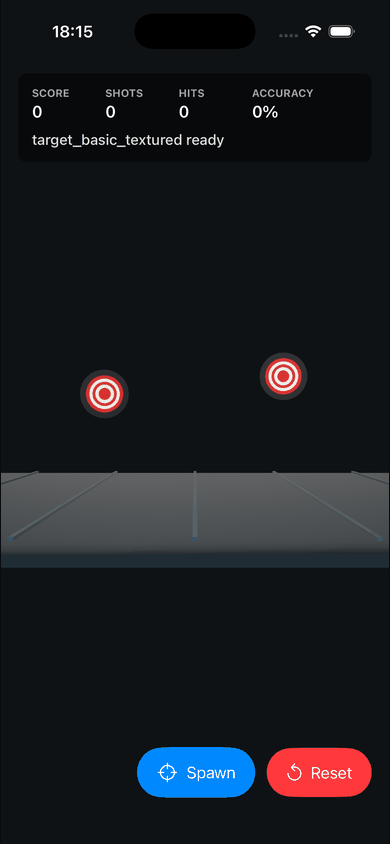
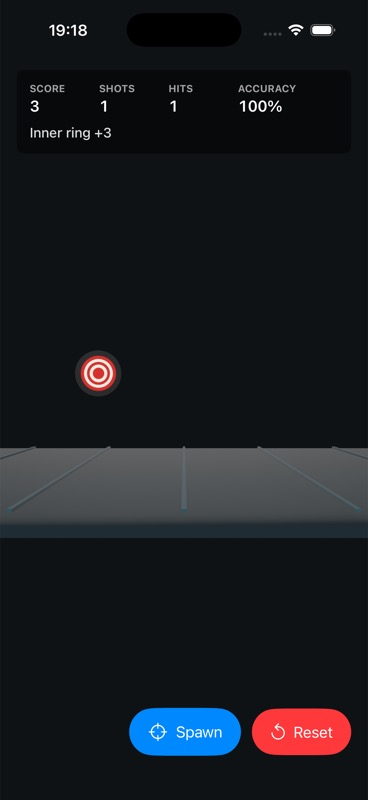

# RealityKit Pipeline Toolkit

[](https://github.com/kingkyylian/realitykitpipelineguide/actions/workflows/ci.yml)


A command-first RealityKit asset pipeline toolkit for taking a gameplay asset from brief to Blender/USDZ output, RealityKit verification, simulator evidence, and release checks.

`rkp` is the product. The included SwiftUI + RealityKit target-shooting app is a verification fixture used to prove that generated or imported assets actually load in RealityKit. `rkg` is experimental labs work on top of the same pipeline; it is not the main user path.

Most RealityKit tutorials stop at code. This repo treats asset production as part of the game loop: each Blender/USDZ asset has a manifest entry, mobile budget, loader contract, screenshot, and learning note.



## What This Is

Primary product:

- `rkp`: the installable CLI for asset status, validation, scaffolding, Blender builds, USDZ inspection, screenshot-based acceptance, tests, and release checks.
- `Skills/realitykit-pipeline-guide`: an installable Codex skill that points agents at the same asset, build, and documentation contracts.
- `.claude/commands`: slash commands such as `/rkp`, `/rkp-asset`, and `/rkp-status` for agent-style usage.
- `Sources/RealityKitPipelineDemo`: a small playable RealityKit verification fixture that proves pipeline output inside an iOS app.
- `Docs`: the teaching, production, and AI-agent handoff layer around the same pipeline.

Experimental labs:

- `rkg`: a game-factory research CLI for scoring ideas, validating specs, scaffolding small RealityKit projects, and generating QA/store-pack docs. Treat it as active research on top of RKP, not as a finished commercial game generator.

Generated assets are tool outputs first. Keep them in `Assets/Imported` and copy or load them in your own RealityKit game when needed; the fixture app is only a verification harness and does not automatically switch its default gameplay target to every newly generated asset.

## Product Boundary

| Surface | Maturity | Use it for | Do not assume |
| --- | --- | --- | --- |
| `rkp` asset pipeline | Preview, actively usable | Asset contracts, Blender/USDZ drafts, manifest health, screenshot acceptance, and release gates. | Fully automatic text-to-3D, automatic Xcode project edits, or asset acceptance without screenshot evidence. |
| RealityKit fixture app | Verification harness | Proving imported USDZ files load and behave inside RealityKit. | A production game architecture or the default destination for every generated asset. |
| Codex skill and docs | Teaching/handoff layer | Keeping agents and contributors on the same commands, contracts, and verification gates. | A standalone MCP server; JSON CLI output is the current automation surface. |
| `rkg` game factory | Experimental labs | GameSpec validation, small generated project scaffolds, archetype exploration, QA/store-pack planning. | A finished commercial game factory or automated App Store submission system. |

## The Normal RKP Path

```bash
rkp init --project-name MyGame
rkp make-asset enemy_drone --type gameplay_target --prompt "red bullseye drone target"
rkp inspect-usdz enemy_drone
rkp verify-asset enemy_drone --build
rkp release-check
```

When simulator or device evidence is available, accept the asset:

```bash
rkp accept-asset enemy_drone --screenshot Docs/screenshots/enemy_drone_imported.jpg
```

This is the product loop. Everything else in the repository exists to teach, verify, or extend that loop.

## Quick Start

Prerequisites:

- Python 3.10+ and `pipx`.
- Blender 4.x if you want to build generated Blender assets locally. See `Docs/blender-support.md` for the support and fallback matrix.
- macOS with Xcode and XcodeGen only if you want to run the included iOS verification fixture.

Install the CLI directly from GitHub:

```bash
pipx install git+https://github.com/kingkyylian/realitykitpipelineguide.git
rkp --version
```

Bootstrap any RealityKit project from that project's root:

```bash
rkp init --project-name MyGame
rkp doctor
rkp make-asset enemy_drone --type gameplay_target --prompt "red bullseye drone target"
rkp release-check
```

Machine-readable status and doctor output are available for scripts and agents:

```bash
rkp status --json
rkp doctor --json
rkp doctor --blender --json
```

The detailed command manual is `Docs/cli-tool.md`.

## Asset Acceptance

RKP keeps draft generation separate from production acceptance:

1. `make-asset` writes the manifest entry, asset brief, and generator script.
2. `build-asset` creates a USDZ draft through Blender or, when requested, the direct fallback builder.
3. `inspect-usdz` checks package presence, texture budget, UV signal, and known triangle budget.
4. `accept-asset` records screenshot evidence and moves the manifest status to `imported`.
5. `release-check` validates the repo or external project gate.

Fallback builds are still drafts. `rkp build-asset enemy_drone --fallback-only` deliberately skips Blender and uses the direct USDZ fallback path when `usdzip` is available, but it does not remove the screenshot acceptance requirement.

## Verification Fixture

| Textured target scoring | Imported arena floor |
| --- | --- |
|  |  |

The fixture app starts with procedural RealityKit fallbacks so it can compile before any custom art exists. The asset pipeline then replaces placeholders with USDZ files exported from Blender into `Assets/Imported`.

To build the included fixture locally:

```bash
make bootstrap-dev
make verify-local
.venv/bin/python Tools/rkp.py release-check
```

CoreSimulator warnings can appear in sandboxed environments; the gate is accepted only when the command exits `0` and prints `release-check ok`.

## Documentation Map

- `Docs/cli-tool.md`: normal RKP commands, JSON automation, advanced backends, and `v0.1` limits.
- `Docs/blender-support.md`: Blender version expectations, `usdzip` fallback behavior, and setup diagnostics.
- `Docs/guide.md`: teaching guide for the full asset journey from gameplay need to RealityKit evidence.
- `Docs/pdf/realitykit-pipeline-guide.pdf`: shareable PDF snapshot of the guide.
- `Docs/production-playbook.md`: production feature/asset gates and definition of done.
- `Docs/new-game-startup.md`: checklist for starting a future RealityKit game.
- `Docs/slash-commands.md`: slash command usage for agent CLIs.
- `Docs/first-good-issues.md`: learner-sized issue candidates.
- `Docs/github-showcase.md`: repo description, topics, and release copy.
- `Docs/ai-handoff.md`: fast orientation page for AI agents and future sessions.
- `Docs/WORKLOG.md`: sprint history, decisions, command evidence, and learning notes.

## What You Learn

- Build a SwiftUI + RealityKit verification fixture.
- Generate and import Blender-authored USDZ assets.
- Keep asset scale, origin, UVs, materials, and texture budgets under control.
- Connect visual texture design to gameplay with ring-based scoring.
- Verify every asset with CLI checks, builds, screenshots, and worklog notes.

Current completed learning modules include first USDZ import, scale/orientation tuning, base color texture, UV `st` primvar lessons, ring-based scoring, arena floor fallback/import, a strong guide PDF, and an installable `rkp` CLI surface.

## Known Limits In v0.1

- RKP generates asset contracts, Blender scripts, USDZ drafts, manifest status, and release checks; it does not automatically wire arbitrary Xcode project resources.
- Blender background USDZ export is machine-sensitive. Use `rkp doctor --blender` for diagnostics and `rkp build-asset --fallback-only` when direct USDZ draft output is intentional.
- The fallback builder is for prompt-backed procedural drafts. Visual acceptance still requires loading the USDZ in RealityKit and providing screenshot evidence.
- RKG is experimental. It can scaffold and verify small fixed-camera RealityKit projects, but generated games still need human product review, visual QA, screenshots, and App Store preparation.
- No standalone MCP server ships yet. `rkp status --json` and `rkp doctor --json` are the stable machine-readable surfaces.
- The package version is currently `0.1.0`. Until release tags are cut, GitHub installs track the default branch.

## GitHub Metadata

Suggested repo description:

```text
Command-first Blender -> USDZ -> RealityKit asset pipeline toolkit with CLI, Codex skill, slash commands, and an iOS verification fixture.
```

Suggested topics:

```text
realitykit, swift, swiftui, ios, blender, usdz, codex-skill, developer-tools, 3d-pipeline, asset-pipeline
```
